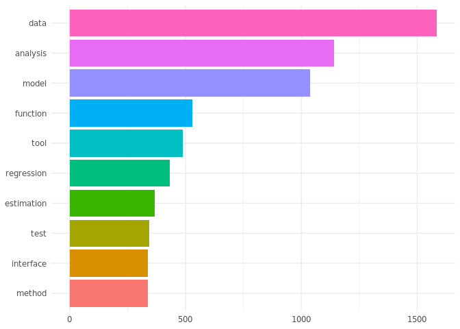
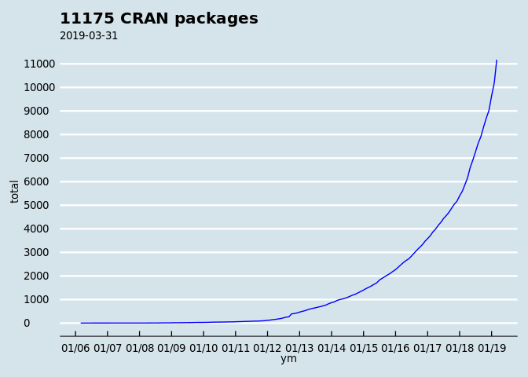

How many packages are there on CRAN?
================

<!-- README.md is generated from README.Rmd. Please edit that file -->
This shows one how to scrape data directly from a website 🕸 (an html table of CRAN packages, structure it as a dataframe and plot it).

> Loads R packages 📦

``` r
library(tidyverse)
library(ggthemes)
library(lubridate)
```

> Loads functionality to decode and plot CRAN data 💻

``` r
source("count_cran.R")
```

> Reads package table (as html) from CRAN and decode it into a dataframe: 👨‍💻

``` r
url_cran <- "http://cran.r-project.org/web/packages/available_packages_by_date.html"
df_cran <- read_file(url_cran) %>% cran_html_to_df
nrow(df_cran)
```

    ## [1] 11175

What's in it?

``` r
glimpse(df_cran)
```

    ## Observations: 11,175
    ## Variables: 3
    ## $ Date    <date> 2019-03-31, 2019-03-31, 2019-03-31, 2019-03-31, 2019-03…
    ## $ Package <chr> "AmigaFFH", "AzureGraph", "bnviewer", "bysykkel", "fastN…
    ## $ Title   <chr> "Commodore Amiga File Format Handler", "Simple Interface…

> What are the top 10 words used in package titles?

``` r
df_cran %>%
  get_top_words(10) %>%
  mutate(word=word%>%fct_inorder%>%fct_rev) %>%
  ggplot(aes(word,n)) +
  geom_col(aes(fill=word)) +
  coord_flip() +
  theme_minimal() +
  theme(legend.position="none")
```



> Plots it! 💹

``` r
df_cran %>%
  plot_cran_df +
  theme_economist()
```



> There you have it! R is growing exponentially!😄
